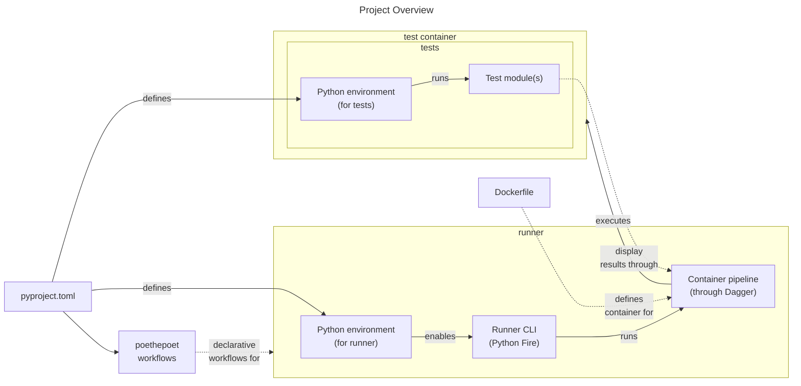

# Demonstrating Python Memory Allocator Reference Counting (and Related)

Demonstrating Python memory allocator reference counting and debug.
The goal of this repository is to help demonstrate Python memory allocation using source controlled code.
Work for this project was originally inspired by [cytomining/CytoTable#75](https://github.com/cytomining/CytoTable/issues/75) which explores related topics.

## Development

The following are suggested steps to get started with development for this project.

1. (Suggested) Install Python from [pyenv](https://github.com/pyenv/pyenv?tab=readme-ov-file#installation) (or another way).
1. [Install Poetry](https://python-poetry.org/docs/#installation)
1. [Install Docker Desktop](https://www.docker.com/products/docker-desktop/)
1. Run Poe the Poet workflow(s): e.g. `poetry run poe run_all_tests`
   _(Poe the Poet is installed as a Poetry env dependency for the `runner` group)_

## Project outline

See above for a quick overview of project components and their relationship.
[Poetry](https://python-poetry.org/docs/) is used to define Python environment dependencies within [dependency groups](https://python-poetry.org/docs/master/managing-dependencies/#dependency-groups) in a `pyproject.toml` file.
Declarative [Poe the Poet tasks](https://poethepoet.natn.io/index.html) may also be found in the same `pyproject.toml` file to help define reproducible workflows.
A "runner" command-line interface (CLI) is provided through [Python Fire](https://github.com/google/python-fire) to help enable the use of the container-based pipelines.
Container-based pipelines are provided through [Dagger's Python SDK](https://docs.dagger.io/sdk/python/) to help isolate potential OS-specific distinctions for memory allocation work in Python.
Testing workflows are designed to run "locally" within a developer's environment (for example, leveraging [pyenv](https://github.com/pyenv/pyenv), [poetry](https://python-poetry.org/docs/), and [Docker Desktop](https://www.docker.com/products/docker-desktop/)) or within [GitHub Actions images](https://github.com/actions/runner-images) (`dagger-io` installs the necessary dependencies).

## Test Modules

This project focuses on leveraging Python memory observability tools to illustrate what happens as code is executed.
See the `src/pymaccounter/tests` folder for a full list of test modules.
Each test module includes a description of what it tests and expects in a [docstring](https://docs.python.org/3/glossary.html#term-docstring) near the top of the file.

### Running Test Modules

Test modules may be executed individually or in groups.
Test modules are provided in a list to be run by containerized pipelines.
Each test provided in this way is run in an isolated container instance.

In addition to test module specification, a test module base directory and debug mode may also be specified.
The test module base directory is where the container pipeline will look for test modules listed by name in the list.
Debug mode may be used to view container pipeline debug log messages.

See the following examples for more details on the suggested way to run tests through this project.

- Individual test: `poetry run python src/pymaccounter/runner.py '["test_baseline.py"]'`
- Multiple tests: `poetry run python src/pymaccounter/runner.py '["test_baseline.py", "test_multiply_gc.collect.py"]'`
- Individual test with debug mode: `poetry run python src/pymaccounter/runner.py '["test_baseline.py"]' --debug True`
- Individual test with non-default base test directory specification: `poetry run python src/pymaccounter/runner.py '["test_baseline.py"]' --test_dir 'src/another_test_dir'`
