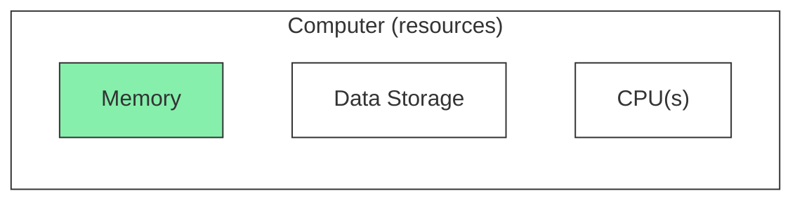
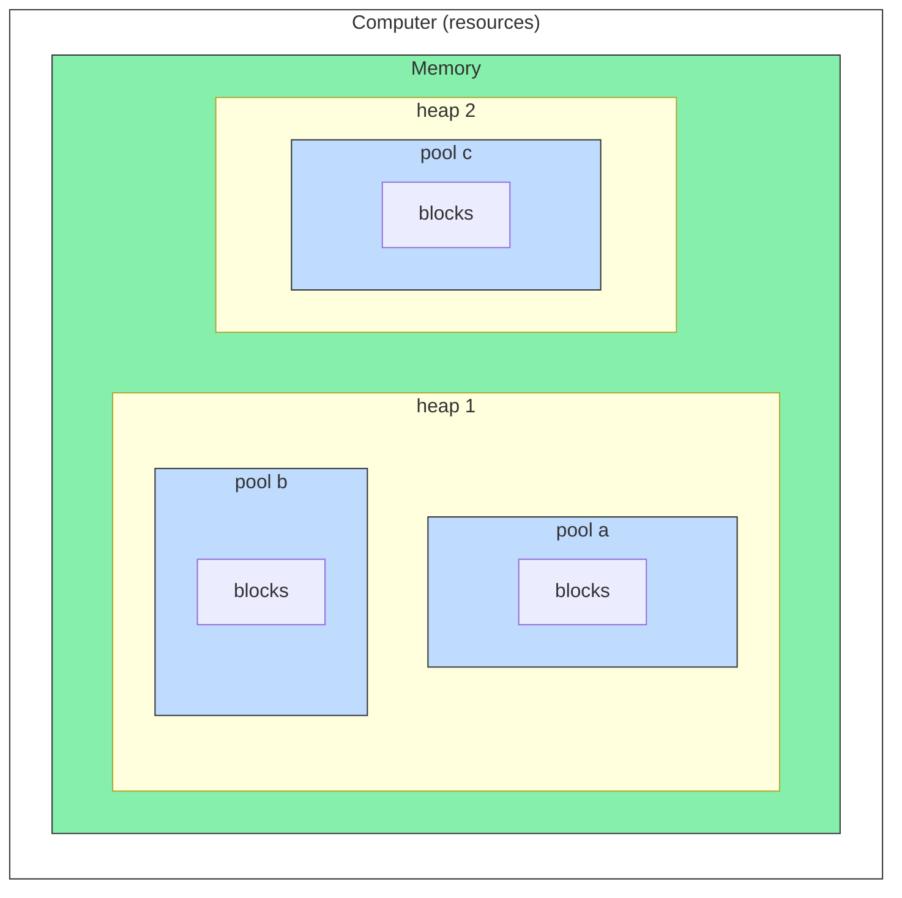
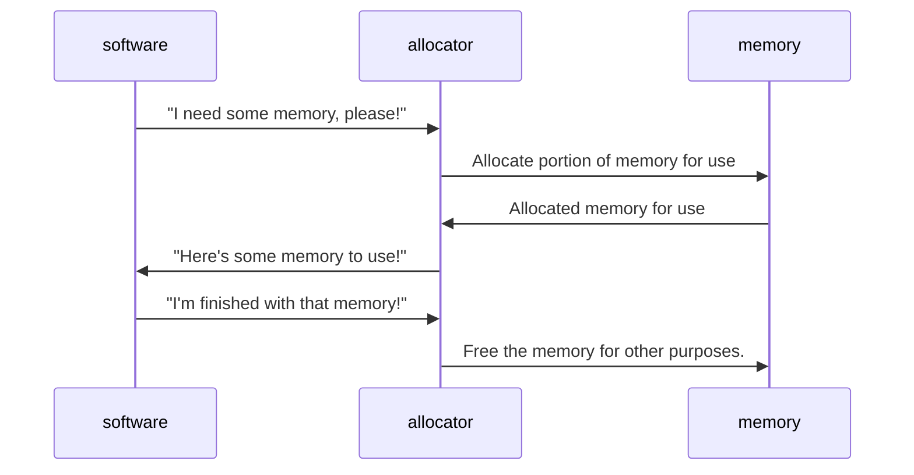
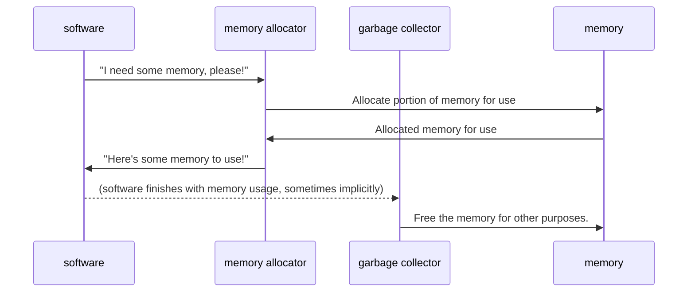
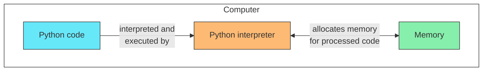
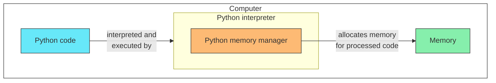
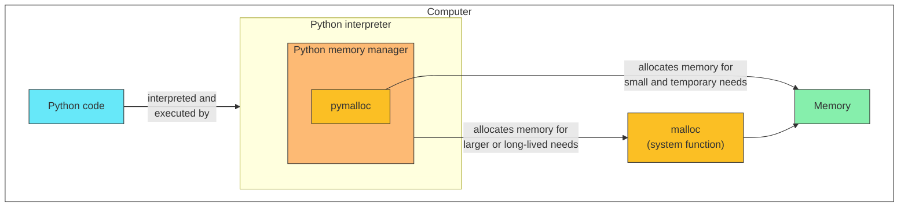
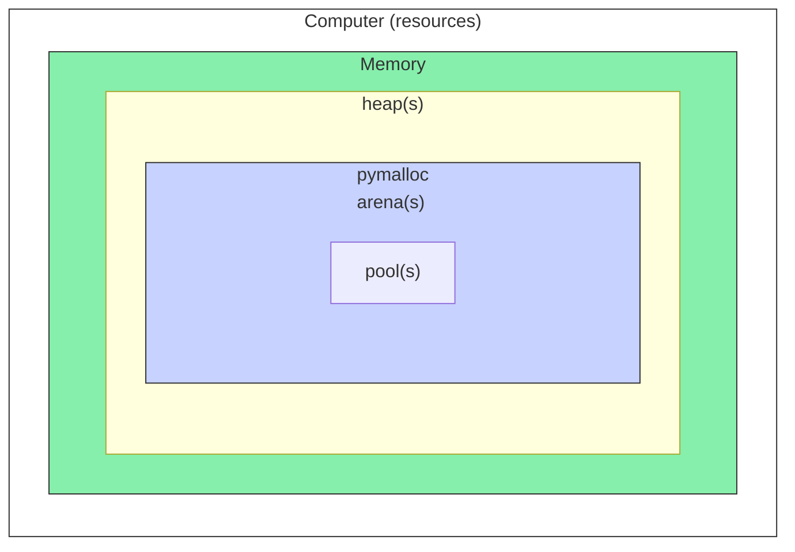
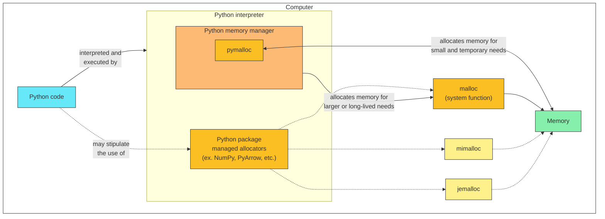
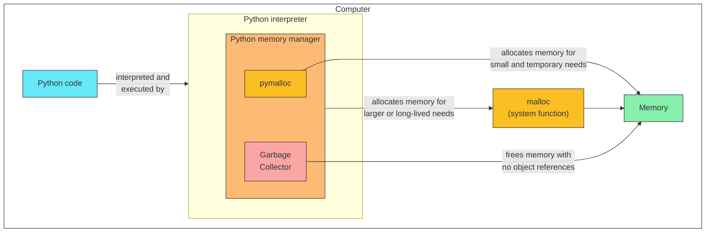

# Demonstrating Python Memory Allocator Reference Counting (and Related)

Demonstrating Python memory allocator reference counting and debug.
The goal of this repository is to help demonstrate Python memory allocation using source controlled code.
Work for this project was originally inspired by [cytomining/CytoTable#75](https://github.com/cytomining/CytoTable/issues/75) which explores related topics.

## Project outline

See above for a quick overview of project components and their relationship.
[Poetry](https://python-poetry.org/docs/) is used to define Python environment dependencies within [dependency groups](https://python-poetry.org/docs/master/managing-dependencies/#dependency-groups) in a `pyproject.toml` file.
Declarative [Poe the Poet tasks](https://poethepoet.natn.io/index.html) may also be found in the same `pyproject.toml` file to help define reproducible workflows.
A "runner" command-line interface (CLI) is provided through [Python Fire](https://github.com/google/python-fire) to help enable the use of the container-based pipelines.
Container-based pipelines are provided through [Dagger's Python SDK](https://docs.dagger.io/sdk/python/) to help isolate potential OS-specific distinctions for memory allocation work in Python.
Testing workflows are designed to run "locally" within a developer's environment (for example, leveraging [pyenv](https://github.com/pyenv/pyenv), [poetry](https://python-poetry.org/docs/), and [Docker Desktop](https://www.docker.com/products/docker-desktop/)) or within [GitHub Actions images](https://github.com/actions/runner-images) (`dagger-io` installs the necessary dependencies).

## Definitions

### Computer Memory

_Computer memory is a type of computer resource available for use by software on a computer_

Computer memory, also sometimes known as "RAM" or "random-access memory", or "dynamic memory" is a type of resource used by computer software on a computer.
"Computer memory stores information, such as data and programs for immediate use in the computer. ... Main memory operates at a high speed compared to non-memory storage which is slower but less expensive and oftentimes higher in capacity. " ([Wikipedia: Computer memory](https://en.wikipedia.org/wiki/Computer_memory)).

<table>
<tr><th colspan="2">Memory Blocks</th></tr>
<tr>
<td>

<strong>A.)</strong> All memory blocks available.

<table>
<tr><td>Block</td><td>Block</td><td>Block</td></tr>
</table>

</td>
<td>

<strong>B.)</strong> Some memory blocks in use.

<table>
<tr><td style="background:#86EFAC;">Block</td><td style="background:#86EFAC;">Block</td><td>Block</td></tr>
</table>

</td>
</tr>
</table>

_Fixed-size memory blocks may be free or used at various times._

One way to organize computer memory is through the use of ["fixed-size blocks"](https://en.wikipedia.org/wiki/Memory_management#FIXED-SIZE), also called "blocks".
Fixed-size memory blocks are chunks of memory of a certain byte size (usually all the same size).
Memory blocks may be in use or free at different times.

_Memory heaps help organize available memory on a computer for specific procedures. Heaps may have one or many memory pools._

Computer memory may be organized in hierarchical layers to help share resources among many software procedures.
One top-level organization model for computer memory is through the use of ___heaps___ which help describe chunks of the total memory available on a computer for specific processes.
These heaps may be ___private___ (only available to a specific software process) or ___shared___ (available to one or many software processes).
Heaps are sometimes further segmented into ___pools___ which are areas of the heap which can be used for specific purposes (for example, when multiple memory allocators are used).

### Memory Allocator

_Memory allocators help software reserve and free computer memory resources._

Memory management is a concept which helps enable the shared use of computer memory to avoid challenges such as memory overuse (where all memory is in use and never shared to other software).
Computer memory management often occurs through the use of a ___memory allocator___ which controls how computer memory resources are used for software.
Computer software is written to interact with memory allocators to use computer memory.
Memory allocators may be used manually (with specific directions provided on when and how to use memory resources) or automatically (with an algorithmic approach of some kind).
The memory allocator usually performs the following actions with memory (in addition to others):

- __"Allocation"__: computer memory resource reservation (taking memory). This is sometimes also known as "`alloc`", or "allocate memory".
- __"Deallocation"__: computer memory resource freeing (giving back memory for other uses). This is sometimes also known as "`free`", or "freeing memory from allocation".

### Garbage Collection

_Garbage collectors help free computer memory which is no longer referenced by software._

"Garbage collection (GC)" is used to describe a type of automated memory management.
"The _garbage collector_ attempts to reclaim memory which was allocated by the program, but is no longer referenced; such memory is called _garbage_." ([Wikipedia: Garbage collection (computer science)](<https://en.wikipedia.org/wiki/Garbage_collection_(computer_science)>)).
A garbage collector often works in tandem with a memory allocator to help control computer memory resource usage in software development.

### Python and Computer Memory

_The Python interpreter helps execute Python code and allocate memory for Python procedures._

Python is an interpreted "high-level" programming language ([Python: What is Python?](https://www.python.org/doc/essays/blurb/)).
Interpreted languages are those which include an "interpreter" which helps execute code written in a particular way ([Wikipedia: Interpreter (computing)](<https://en.wikipedia.org/wiki/Interpreter_(computing)>)).
High-level languages such as Python often remove the requirement for software developers to manually perform memory management ([Wikipedia: High-level programming language](https://en.wikipedia.org/wiki/High-level_programming_language)).
Python code is executed by a commonly pre-packaged and downloaded binary call the Python [interpreter](<https://en.wikipedia.org/wiki/Interpreter_(computing)>).
The Python interpreter reads Python code and performs memory management as the code is executed.

#### Python's Memory Manager

_The Python memory manager helps manage memory for Python code executed by the Python interpreter._

Memory is managed for Python software processes automatically (when unspecified) or manually (when specified) through the Python interpreter.
The ___Python memory manager___ is an abstraction which manages memory for Python software processes through the Python interpreter and CPython ([Python: Memory Management](https://docs.python.org/3/c-api/memory.html)).
From a high-level perspective, we assume variables and other operations written in Python will automatically allocate and deallocate memory through the Python interpreter when executed.
Python's memory manager performs this work through various __memory allocators__ and a __garbage collector__ (or as configured with customizations).

##### Python's Memory Allocators

_The Python memory manager by default will use `pymalloc` internally or malloc from the system to allocate computer memory resources._

The Python memory manager allocates memory for use through memory allocators.
Python may use one or many memory allocators depending on specifications in Python code and how the Python interpreter is configured (for example, see [Python: Memory Management - Default Memory Allocators](https://docs.python.org/3/c-api/memory.html#default-memory-allocators)).
One way to understand Python memory allocators is through the following distinctions.

- __"Python Memory Allocator" (`pymalloc`)__
  The Python interpreter is packaged with a specialized memory allocator called `pymalloc`.
  "Python has a pymalloc allocator optimized for small objects (smaller or equal to 512 bytes) with a short lifetime." ([Python: Memory Management - The pymalloc allocator](https://docs.python.org/3/c-api/memory.html#the-pymalloc-allocator))
- __C dynamic memory allocator (`malloc`)__
  When `pymalloc` is disabled or a memory requirements exceed `pymalloc`'s constraints, the Python interpreter will use a function from the [C standard library](https://en.wikipedia.org/wiki/C_standard_library) called [`malloc`](<%5B%60malloc%60%5D(https://en.wikipedia.org/wiki/C_dynamic_memory_allocation)>).
  When `malloc` is used by the Python interpreter, it uses the system's existing implementation of `malloc`.

_`pymalloc` makes use of arenas to further organize pools within a computer memory heap._

It's important to note that `pymalloc` adds additional abstractions to how memory is organized through the use of "arenas".
`pymalloc` may be disabled through the use of a special environment variable called [`PYTHONMALLOC`](https://docs.python.org/3/using/cmdline.html#envvar-PYTHONMALLOC) (for example, to use only [`malloc`](https://en.wikipedia.org/wiki/C_dynamic_memory_allocation) as seen below).
This same environment variable may be used with `debug` settings in order to help troubleshoot in-depth questions.

__Additional Python Memory Allocators__

_Python code and package dependencies may stipulate the use of additional memory allocators, such as `mimalloc` and `jemalloc` outside of the Python memory manager._

Python provides the capability of customizing memory allocation through the use of packages.
See below for some notable examples of additional memory allocation possibilities.

- __NumPy Memory Allocation__
  [NumPy](https://numpy.org/) [uses custom C-API's](https://numpy.org/doc/stable/reference/c-api/data_memory.html) which are backed by C dynamic memory allocation functions (`alloc`, `free`, `realloc`) to help address memory management.
  These interfaces can be controlled directly through NumPy to help manage memory effectively when using the package.
- __PyArrow Memory Allocators__
  [PyArrow](https://arrow.apache.org/) provides the capability to use `malloc`, [`jemalloc`](https://github.com/jemalloc/jemalloc), or [`mimalloc`](https://github.com/microsoft/mimalloc) through the [PyArrow Memory Pools group of functions](https://arrow.apache.org/docs/python/api/memory.html#memory-pools).
  A default memory allocator is selected for use when PyArrow based on the operating system and the availability of the memory allocator on the system.
  The selection of a memory allocator for use with PyArrow can be influenced by how it performs on a particular system.

##### Python's Garbage Collection

Python by default uses an optional garbage collector to automatically deallocate garbage memory through the Python interpreter in CPython.
"The main garbage collection algorithm used by CPython is reference counting. The basic idea is that CPython counts how many different places there are that have a reference to an object. Such a place could be another object, or a global (or static) C variable, or a local variable in some C function. When an object’s reference count becomes zero, the object is deallocated." ([Python Developer's Guide: Garbage collector design](https://devguide.python.org/internals/garbage-collector/))
Python's garbage collector is generally focused on collecting garbage created by `pymalloc` and `malloc`.

The [`gc` module](https://docs.python.org/3/library/gc.html) provides an interface to the Python garbage collector.
In addition, the [`sys` module](https://docs.python.org/3/library/sys.html) provides many functions which provide information about references and other details about Python objects as they are executed through the interpreter.
These functions and other packages can help software developers observe memory behaviors within Python procedures.

## Development

The following are suggested steps to get started with development for this project.

1. (Suggested) Install Python from [pyenv](https://github.com/pyenv/pyenv?tab=readme-ov-file#installation) (or another way).
1. [Install Poetry](https://python-poetry.org/docs/#installation)
1. [Install Docker Desktop](https://www.docker.com/products/docker-desktop/)
1. Run Poe the Poet workflow(s): e.g. `poetry run poe run_all_tests`
   _(Poe the Poet is installed as a Poetry env dependency for the `runner` group)_

## Test Modules

This project focuses on leveraging Python memory observability tools to illustrate what happens as code is executed.
See the `src/pymaccounter/tests` folder for a full list of test modules.
Each test module includes a description of what it tests and expects in a [docstring](https://docs.python.org/3/glossary.html#term-docstring) near the top of the file.

### Running Test Modules

Test modules may be executed individually or in groups.
Test modules are provided in a list to be run by containerized pipelines.
Each test provided in this way is run in an isolated container instance.

In addition to test module specification, a test module base directory and debug mode may also be specified.
The test module base directory is where the container pipeline will look for test modules listed by name in the list.
Debug mode may be used to view container pipeline debug log messages.

See the following examples for more details on the suggested way to run tests through this project.

- Individual test: `poetry run python src/pymaccounter/runner.py '["test_baseline.py"]'`
- Multiple tests: `poetry run python src/pymaccounter/runner.py '["test_baseline.py", "test_multiply_gc.collect.py"]'`
- Individual test with debug mode: `poetry run python src/pymaccounter/runner.py '["test_baseline.py"]' --debug True`
- Individual test with non-default base test directory specification: `poetry run python src/pymaccounter/runner.py '["test_baseline.py"]' --test_dir 'src/another_test_dir'`
